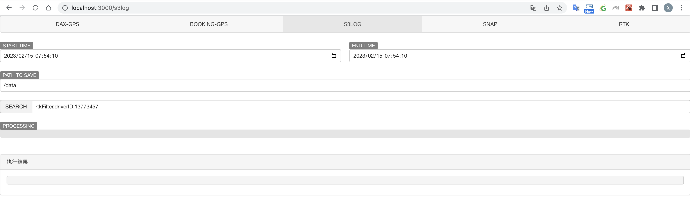
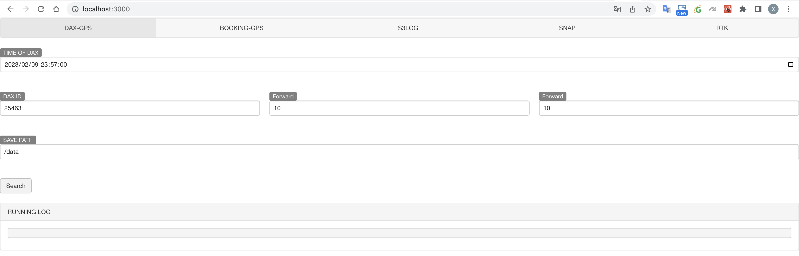
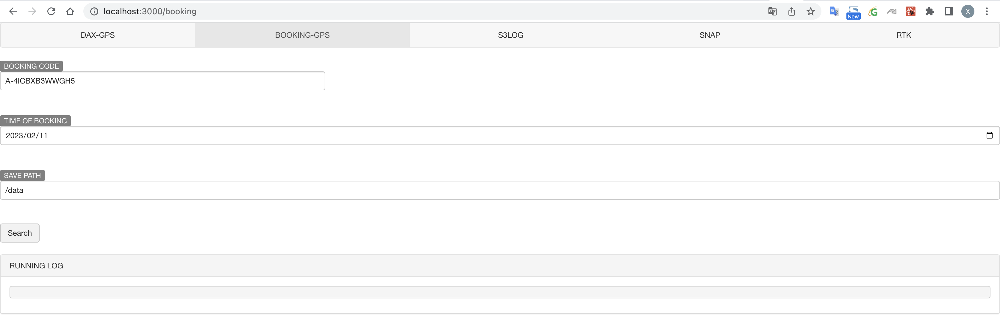
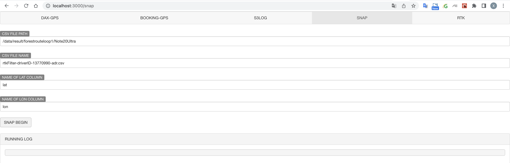
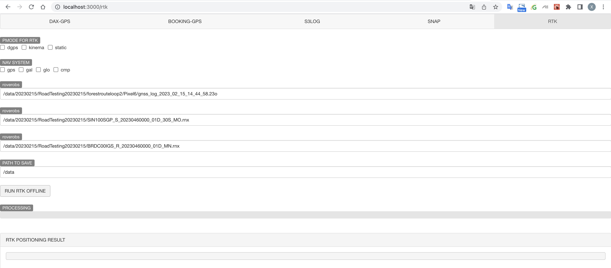

# RTK离线测试工具

## 修改配置

### 1、PYTHON
* 首先配置awscli : https://wiki.grab.com/display/NET/AWS+CLI%2C+Boto3+and+Web+Console+Access+with+AWS+SSO+and+Cisco+Duo+MFA#expand-Screenshot
* ~/.aws/config用户名应该为ssm-user，配置好后的内容应该如下所示:
```
[profile ssm-user]
sso_start_url = https://grab-sso.awsapps.com/start
sso_region = ap-southeast-1
sso_account_id = xxxxxx
sso_role_name = geo-grabroad-engineer
region = ap-southeast-1
```
建议在启动该docker-compose之前，先执行一次```aws sso login --profile ssm-user```登录认证一下aws,如果出现有关SSO登录的错误提示，请重新执行该命令进行登录

### 2、GO
修改[config.yaml](./BE/GOLANG/HTTP/SERVER/positioning_db_service/config.yaml)中presto的用户名和密码，用于访问presto

### 3、FE
修改[.env](./FE/react//positioning-tool/.env)中的REACT_APP_LOCALHOST，改成自己本机的地址

### 在下载目录下创建文件夹 positioning-data,将离线测试文件放到其中

## 1、启动:
```
docker-compose up
```
该命令在第一次执行时会构建所有服务的镜像，然后自动启动这些镜像，后续除非手动构建镜像，否则不会在自动构建这些镜像

### 2、如果修改了某个server的代码，该如何重新构建镜像?
以python服务为例，如果发现了某个bug，修改代码后，可以通过以下命令重建镜像
```
docker-compose build positioning-python-server
```

### 3、通过POSTMAN使用该环境
* 下载Log (postman):
POST http://localhost:8000/downlog
```
{
    "starttime": "2023-02-15 06:17:46",
    "endtime": "2023-02-15 06:38:33",
    "filter": [
        "rtkFilter",
        "driverID:13770990"
    ],
    "outputpath": "/data20230215/result/forestrouteloop1/Note20Ultra"
}
```

* 解析Log
POST http://localhost:8000/parselog
```
{
    "filepath": "/data20230215/result/forestrouteloop1/Note20Ultra",
    "loglist": [
        {
            "logtype": "rtk",
            "logfile": "rtkFilter-driverID-13770990.log"
        },
        {
            "logtype": "rtk",
            "logfile": "rtkFilter-driverID-13773457.log"
        },
        {
            "logtype": "dongle",
            "logfile": "decodedongle-donglereplacement-driver13770990.log"
        }
    ],
    "outputpath": "/data20230215/result/forestrouteloop1/Note20Ultra"
}
```
* 运行RTK
POST http://localhost:8001/DEMO5/RTK/demo5
```
{
    "rtk": {
        "pmode": [
            "dgps"
        ],
        "navsys": [
            "gps-gal-glo"
        ],
        "obsnav": {
            "roverobs": "/data20230215/RoadTesting20230215/forestrouteloop1/Note20Ultra/gnss_log_2023_02_15_14_17_28.23o",
            "stationobs": "/Users/xiaolong.ji/Downloads/rtK/20230215/RoadTesting20230215/SIN100SGP_S_20230460000_01D_30S_MO.rnx",
            "stationnav": "/Users/xiaolong.ji/Downloads/rtK/20230215/RoadTesting20230215/BRDC00IGS_R_20230460000_01D_MN.rnx"
        } 
    },
    "outputpath": "/data20230215/result/forestrouteloop1/Note20Ultra"
}
```

* 自动解析结果
POST http://localhost:8000/parsertkroadtest
```
{
    "filepath": "/data20230215/result/forestrouteloop1/Note20Ultra",
    "groundtruth": {
        "type": "dongle",
        "content": "decodedongle-donglereplacement-driver13770990-device.csv"
    },
    "adrcsv": "rtkFilter-driverID-13770990-adr.csv",
    "rtkcsv": "rtkFilter-driverID-13770990-rtk.csv",
    "offlinertkcsv": [
        "PMODE_DGPS_GPS_GLO_GAL.csv",
        "PMODE_DGPS_GPS_GLO_GAL_CMP.csv",
        "PMODE_KINEMA_GPS_GLO_GAL.csv",
        "PMODE_KINEMA_GPS_GLO_GAL_CMP.csv",
        "PMODE_STATIC_GPS_GLO_GAL.csv",
        "PMODE_STATIC_GPS_GLO_GAL_CMP.csv"
    ],
    "outputpath": "/data20230215/result/forestrouteloop1/Note20Ultra/distanceSummary"
}
```

可以通过[postman-positioning-team](https://app.getpostman.com/join-team?invite_code=968295ea841ef2eddcaf05745cc8df53&target_code=9427bed32b75750ca6aa7e5aecbb820f)加入到positioning-team组织中，该组织内已经写好了各种请求

### 4、通过浏览器使用该环境

* 下载Log (chrome)  
在浏览器上打开http://localhost:3000


* 请求司机的GPS轨迹  
在浏览器上打开http://localhost:3000


* 请求订单的GPS轨迹  
在浏览器上打开http://localhost:3000


* Snap To road  
在浏览器上打开http://localhost:3000


* OFFLINE RTK  
在浏览器上打开http://localhost:3000
